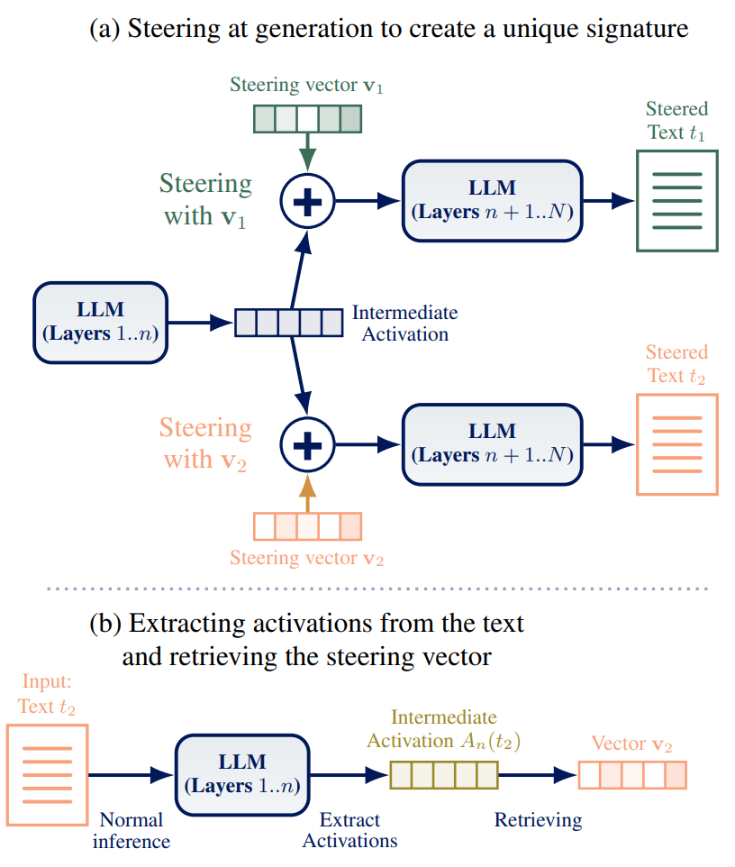
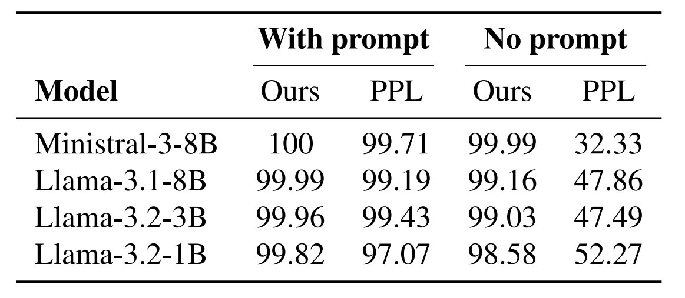
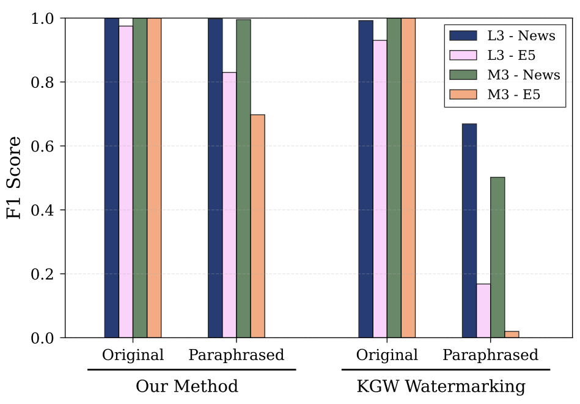

# LLM Self-Recognition: Steering and Retrieving Activation Signatures

[](https://icml.cc/)
[]()
[]()
[]()


This repository contains the official implementation of the paper **"LLM Self-Recognition: Steering and Retrieving Activation Signatures"** (In review at ICML 2026). 

We introduce a method to watermark and attribute LLM-generated text by leveraging the model's internal "self-recognition" capabilities. By steering the residual stream with sparse, random vectors during generation, we embed a detectable fingerprint that can be retrieved directly from the model's activations—without modifying the output distribution's vocabulary or degrading generation quality.



*Figure 1: (a) Steering the model during generation with a sparse vector. (b) Retrieving the signature from activations during a forward pass.*

## 📂 Repository Structure

The codebase is organized into two primary modules corresponding to the two main contributions of the paper: **Intrinsic Self-Recognition** and **Steering-Based Watermarking**.


```bash
.
├── self_recognition/   # Part 1: AI-GTD using natural signals
│   ├── configs/
│   ├── main.py         # To run the different configs
│   ├── README.md
│   └── requirements.txt
├── steering_watermark/ # Part 2: Steering & Multi-Model Attribution
│   ├── notebooks/      # Results analysis
│   ├── src/            # Source code of the pipeline 
│   ├── text_data/      # Text data: Fresh News, ELI5
├   └── requirements.txt
└── README.md
```

## 🚀 Getting Started
Install the requirements associated to the folder in use: `self_recognition` or `steering_watermark`.

```bash
pip install -r requirements.txt
```

### 1. Self-Recognition (Unsteered)
Investigate the intrinsic capability of LLMs (e.g., Llama3.1, Ministral3) to distinguish their own output from human-written text using internal activations.

- **Key Insight**: A lightweight LDA classifier on layer-wise activations achieves >98% detection accuracy.



- Reproducibility target: Table 1 in the paper (AUROC comparison vs. Perplexity).

### 2. Steering and Attribution (Watermarking)
Apply sparse random steering vectors to watermark generation. This module handles:

1. Steering: Injecting sparse signals ($v$) into the residual stream at layer $L$.

2. Generation: Producing text with specific "models"

3. Retrieval: Recovering the signal via Cosine Similarity (training-free) or MLP probing.

**Key Insight**: Steering vectors seems orthogonal to semantic features, allowing reliable retrieval even after strong paraphrasing (Dipper-XXL) without quality loss.

<!-- - Notebook: notebooks/02_steering_watermark_demo.ipynb -->


Figure 2: Robustness of our method to paraphrasing compared to the KGW classical watermark.

## 📊 Datasets
The project utilizes three main datasets to evaluate robustness across entropy regimes.

| Dataset     | Code module        | Entropy level | Type          | Link                                                                 |
| :---------- | :----------------- | :------------ | :------------ | :------------------------------------------------------------------- |
| XL-Sum      | Self-recognition   | Low           | Summarization | [HuggingFace](https://huggingface.co/datasets/csebuetnlp/xlsum)      |
| ELI5        | Steering & detection | Medium        | QA            | [HuggingFace](https://huggingface.co/datasets/Hello-SimpleAI/HC3)    |
| Fresh News  | Steering & detection | High          | Open-ended    | [Scrapped](steering_watermark/text_data/guardian_from_nov2025_articles_v2.10k) |


*Note: The Fresh News dataset consists of articles published between Nov 2025 and Jan 2026 to ensure no contamination with model training data.*

## 📈 Key Results
Our method provides a simple attribution mechanism that scales to multiple model instances.

High Accuracy: >99% F1 score for multi-model attribution on capable models, distinguishing between different steered versions of the same base model.

Robustness: The signal persists even after paraphrasing.

Quality Preservation: Minimal impact on perplexity and DeBERTa quality metrics compared to standard watermarking.


## 📝 Citation
If you use this code or findings in your research, please cite our paper:

```
@inproceedings{anonymous2026selfrecognition,
  title={LLM Self-Recognition: Steering and Retrieving Activation Signatures},
  author={Anonymous Authors},
  booktitle={},
  year={},
  url={}
}
```

## 📄 License
This project is licensed under the MIT License - see the LICENSE file for details.